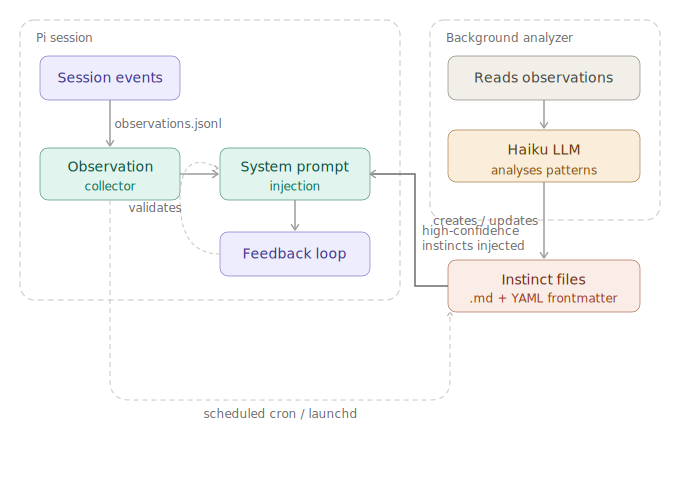

# pi-continuous-learning

> A [Pi](https://github.com/nicholasgasior/pi-coding-agent) extension that watches your coding sessions and distills patterns into reusable **instincts** — atomic learned behaviours with confidence scoring, project scoping, and closed-loop feedback validation.

[](https://github.com/MattDevy/pi-continuous-learning/actions/workflows/ci.yml)
[](https://www.npmjs.com/package/pi-continuous-learning)
[](LICENSE)

<!-- markdownlint-disable MD033 -->
<a href="https://www.buymeacoffee.com/MattDevy"></a>
<!-- markdownlint-enable MD033 -->

Inspired by [everything-claude-code/continuous-learning-v2](https://github.com/nicholasb/everything-claude-code), reimplemented as a native Pi extension in TypeScript.

---

## How it works



**The key idea:** the extension watches what you do, learns patterns, injects relevant instincts into future sessions, then validates whether those instincts actually helped — adjusting confidence based on real outcomes rather than observation count alone.

The analyzer runs as a **separate background process** so it never causes lag or interference inside your Pi session.

---

## Installation

```bash
pi install npm:pi-continuous-learning
```

This installs the extension globally and makes the `pi-cl-analyze` CLI available on your PATH.

### Requirements

| Requirement | Version |
|---|---|
| [Pi](https://github.com/nicholasgasior/pi-coding-agent) | >= 0.62.0 |
| Node.js | >= 18 |
| LLM provider | configured in Pi (analyzer defaults to Haiku) |

---

## Usage

Once installed, the extension runs automatically — no configuration required. To analyse observations and create instincts, set up the [background analyzer](#background-analyzer).

### Slash commands

| Command | Description |
|---|---|
| `/instinct-status` | Show all instincts grouped by domain with confidence scores and feedback stats |
| `/instinct-evolve` | LLM-powered analysis: suggests merges, promotions, and cleanup |
| `/instinct-export` | Export instincts to JSON (filterable by scope/domain) |
| `/instinct-import <path>` | Import instincts from a JSON file |
| `/instinct-promote [id]` | Promote project instincts to global scope |
| `/instinct-graduate` | Graduate mature instincts to AGENTS.md, skills, or commands |
| `/instinct-projects` | List all known projects and their instinct counts |

### LLM tools

The extension registers tools the LLM can call directly during conversation:

| Tool | Description |
|---|---|
| `instinct_list` | List instincts with optional scope/domain filters |
| `instinct_read` | Read a specific instinct by ID |
| `instinct_write` | Create or update an instinct |
| `instinct_delete` | Remove an instinct by ID |
| `instinct_merge` | Merge multiple instincts into one |

You can ask Pi things like _"show me my instincts"_, _"merge these two instincts"_, or _"delete low-confidence instincts"_ and it will use these tools.

---

## Background analyzer

The analyzer is a standalone CLI that processes all your projects in a single pass and creates/updates instincts using Haiku. It runs outside of Pi sessions for efficiency.

### Running manually

```bash
pi-cl-analyze
```

The script:

1. Iterates all projects in `~/.pi/continuous-learning/projects.json`
2. Skips projects with no new observations since the last run
3. Skips projects with fewer than 20 observations (configurable)
4. For eligible projects: runs confidence decay, then uses Haiku to analyse patterns and write instinct files
5. Records a cursor so only new observations are processed on subsequent runs

**Safety features:**

| Feature | Detail |
|---|---|
| Lockfile guard | Only one instance runs at a time — subsequent invocations exit immediately |
| Global timeout | Process exits after 5 minutes regardless of progress |
| Stale lock detection | Auto-cleaned after 10 minutes or if the owning process is no longer alive |

### Logging

Structured JSON logs are written to `~/.pi/continuous-learning/analyzer.log`. Each run records timing, token usage, cost, instinct changes, skip reasons, and errors.

```bash
# View recent run summaries
cat ~/.pi/continuous-learning/analyzer.log | jq 'select(.event == "run_complete")'

# Check total cost over time
cat ~/.pi/continuous-learning/analyzer.log | jq 'select(.event == "run_complete") | .total_cost_usd'

# Per-project breakdown
cat ~/.pi/continuous-learning/analyzer.log | jq 'select(.event == "project_complete") | {project: .project_name, duration_s: (.duration_ms/1000), cost: .cost_usd}'
```

The log auto-rotates at 10 MB. When the log file is not writable, output falls back to stderr.

### Scheduling (macOS)

The recommended approach on macOS is `launchd`:

#### 1. Find the binary path

```bash
which pi-cl-analyze
```

#### 2. Create the plist

```bash
cat > ~/Library/LaunchAgents/com.pi-continuous-learning.analyze.plist << EOF
<?xml version="1.0" encoding="UTF-8"?>
<!DOCTYPE plist PUBLIC "-//Apple//DTD PLIST 1.0//EN" "http://www.apple.com/DTDs/PropertyList-1.0.dtd">
<plist version="1.0">
<dict>
    <key>Label</key>
    <string>com.pi-continuous-learning.analyze</string>
    <key>ProgramArguments</key>
    <array>
        <string>$(which pi-cl-analyze)</string>
    </array>
    <key>StartInterval</key>
    <integer>300</integer>
    <key>StandardOutPath</key>
    <string>/tmp/pi-cl-analyze-stdout.log</string>
    <key>StandardErrorPath</key>
    <string>/tmp/pi-cl-analyze-stderr.log</string>
    <key>EnvironmentVariables</key>
    <dict>
        <key>PATH</key>
        <string>$(echo $PATH)</string>
    </dict>
</dict>
</plist>
EOF
```

> **Note:** `$(which pi-cl-analyze)` and `$(echo $PATH)` are evaluated when you run the `cat` command, so the plist contains the resolved absolute paths from your current shell.

#### 3. Load

```bash
launchctl load ~/Library/LaunchAgents/com.pi-continuous-learning.analyze.plist
```

#### 4. Verify

```bash
launchctl list | grep pi-continuous-learning
tail -5 ~/.pi/continuous-learning/analyzer.log | jq .
```

#### Managing the schedule

```bash
# Disable (persists across reboots)
launchctl unload ~/Library/LaunchAgents/com.pi-continuous-learning.analyze.plist

# Re-enable
launchctl load ~/Library/LaunchAgents/com.pi-continuous-learning.analyze.plist

# Remove entirely
rm ~/Library/LaunchAgents/com.pi-continuous-learning.analyze.plist
```

### Scheduling (Linux)

```bash
crontab -e
# Add: runs every 5 minutes
*/5 * * * * pi-cl-analyze 2>> /tmp/pi-cl-analyze-stderr.log
```

---

## Instinct files

Instincts are stored as Markdown files with YAML frontmatter under `~/.pi/continuous-learning/`:

```yaml
---
id: grep-before-edit
title: Grep Before Edit
trigger: "when modifying code files"
confidence: 0.7
domain: "workflow"
source: "personal"
scope: project
project_id: "a1b2c3d4e5f6"
project_name: "my-project"
observation_count: 8
confirmed_count: 5
contradicted_count: 1
inactive_count: 12
---
Always search with grep to find relevant context before editing files.
```

---

## Confidence scoring

Confidence comes from two sources:

**Discovery** (initial, based on observation count):

| Observations | Confidence |
|---|---|
| 1–2 | 0.30 — tentative |
| 3–5 | 0.50 — moderate |
| 6–10 | 0.70 — strong |
| 11+ | 0.85 — very strong |

**Feedback** (ongoing, based on real outcomes):

| Event | Change |
|---|---|
| Confirmed (behaviour aligned) | +0.05 |
| Contradicted (behaviour went against) | −0.15 |
| Inactive (instinct irrelevant) | no change |
| Passive decay | −0.02 per week without observations |

Range: 0.1 min, 0.9 max. Below 0.1 = flagged for removal.

---

## Instinct quality control

Every write is validated and deduplicated before saving.

**Content rules:** `action` and `trigger` must be non-empty, >= 10 characters, and from a known domain (`git`, `testing`, `debugging`, `workflow`, `typescript`, `javascript`, `python`, `go`, `css`, `design`, `security`, `performance`, `documentation`, `react`, `node`, `database`, `api`, `devops`, `architecture`, `other`).

**Semantic deduplication:** a Jaccard similarity check runs against all existing instincts. If any existing instinct scores >= 0.6, the write is blocked and the LLM is told to update the existing one instead.

**Analyzer quality tiers:**

| Tier | Pattern type | Action |
|---|---|---|
| 1 — Project conventions | e.g. "use `Result<T,E>` for errors in this codebase" | Record as project-scoped instinct |
| 2 — Workflow patterns | Universal multi-step workflows | Record as global-scoped instinct |
| 3 — Generic agent behaviour | Read-before-edit, clarify-before-implement | **Skip entirely** |

---

## Instinct graduation

Instincts are designed to be short-lived — they should graduate into permanent knowledge within a few weeks:

```text
Observation → Instinct (days) → AGENTS.md / Skill / Command (1–2 weeks)
```

**Graduation targets:**

| Target | When | What happens |
|---|---|---|
| AGENTS.md | Single mature instinct | Appended as a guideline to your project or global AGENTS.md |
| Skill | 3+ related instincts in the same domain | Scaffolded into a `SKILL.md` file |
| Command | 3+ workflow instincts in the same domain | Scaffolded into a slash command specification |

**Maturity criteria:** age >= 7 days, confidence >= 0.75, confirmed >= 3 times, contradicted <= 1 time, not a duplicate of existing AGENTS.md content.

**TTL enforcement** (after 28 days without graduation):

- Confidence < 0.3 → deleted
- Confidence >= 0.3 → confidence halved and flagged for removal

---

## Configuration

All defaults work out of the box. Override at `~/.pi/continuous-learning/config.json`:

```json
{
  "run_interval_minutes": 5,
  "min_observations_to_analyze": 20,
  "min_confidence": 0.5,
  "max_instincts": 20,
  "max_injection_chars": 4000,
  "model": "claude-haiku-4-5",
  "timeout_seconds": 120,
  "active_hours_start": 8,
  "active_hours_end": 23,
  "max_idle_seconds": 1800
}
```

| Field | Default | Description |
|---|---|---|
| `run_interval_minutes` | 5 | How often the analyzer runs (used for decay calculations) |
| `min_observations_to_analyze` | 20 | Minimum observations before analysis triggers |
| `min_confidence` | 0.5 | Instincts below this are not injected into prompts |
| `max_instincts` | 20 | Maximum instincts injected per turn |
| `max_injection_chars` | 4000 | Character budget for the injection block (~1000 tokens) |
| `model` | `claude-haiku-4-5` | Model for the background analyzer |
| `timeout_seconds` | 120 | Per-project LLM session timeout |
| `active_hours_start` | 8 | Hour (0–23) at which the active observation window starts |
| `active_hours_end` | 23 | Hour (0–23) at which the active observation window ends |
| `max_idle_seconds` | 1800 | Seconds of inactivity before a session is considered idle |
| `log_path` | `~/.pi/continuous-learning/analyzer.log` | Analyzer log file path |

---

## Storage

All data stays local on your machine:

```text
~/.pi/continuous-learning/
  config.json                   # Optional overrides
  projects.json                 # Project registry
  analyze.lock                  # Present only while analyzer runs
  instincts/personal/           # Global instincts
  projects/<hash>/
    project.json                # Project metadata + analysis cursor
    observations.jsonl          # Current observations
    observations.archive/       # Archived (auto-purged after 30 days)
    instincts/personal/         # Project-scoped instincts
```

## Privacy & security

- All data stays on your machine — no external telemetry
- Secrets (API keys, tokens, passwords) are scrubbed from observations before writing to disk
- Only instincts (patterns) can be exported — never raw observations
- The analyzer uses your existing Pi LLM credentials — no additional keys needed

---

## Updating

```bash
pi install npm:pi-continuous-learning
```

Your observations, instincts, and configuration in `~/.pi/continuous-learning/` are preserved across updates. If you have a launchd schedule set up, no changes needed.

---

## Development

```bash
npm install
npm test          # run tests
npm run check     # tests + lint + typecheck (mirrors CI)
npm run build     # compile to dist/
```

See [CONTRIBUTING.md](CONTRIBUTING.md) for full development guidelines.

---

## Contributing

Contributions are welcome! See [CONTRIBUTING.md](CONTRIBUTING.md) for development setup, commit conventions, and PR guidelines.

Please note that this project has a [Code of Conduct](CODE_OF_CONDUCT.md). By participating you agree to abide by its terms.

---

## License

MIT
